

## Contents

1. [Uploading the Proteomics Expression Dataset and Group Information](#uploading-the-proteomics-expression-dataset-and-group-information)
2. [Getting the Results](#getting-the-results)
3. [Exploratory Plots Visualization](#exploratory-plots-visualization)
4. [Differential Expression Analysis](#differential-expression-analysis)

### 1. Uploading the Proteomics Expression Dataset and Group Information

To upload the data, navigate to the **‘Data Upload’** tab. The user can upload their dataset either from local storage or use the provided example datasets. This Shiny application supports both peptide-based and protein-based proteomics datasets. Accepted file formats include **‘.xlsx’**, **‘.xls’**, and **‘.csv’**.

- **Peptide-based datasets**: The first column should contain peptide information, and the second column should contain protein information.
- **Protein-based datasets**: The first column should contain protein information, while the remaining columns should contain protein expression values.

Below are examples of peptide-based and protein-based proteomics datasets:

  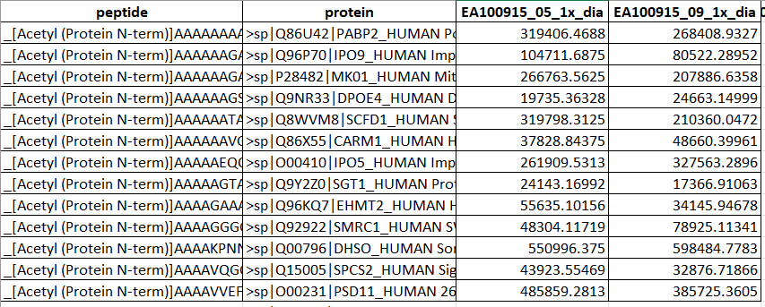
  
<strong>Figure 1:</strong> Example peptide-based proteomics expression dataset

  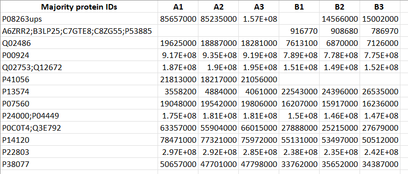
  
<strong>Figure 2:</strong> Example protein-based proteomics expression dataset

Users must also upload sample group information corresponding to the proteomics expression dataset. An example of sample group information for the protein-based dataset is shown below:

  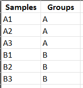
  
<strong>Figure 3:</strong> Sample group information for the example protein data

Specify the data type (Peptide or Protein) and select the appropriate peptide aggregation method (sum, mean, or median) if peptide data is used. This will generate the aggregated or rollup protein dataset, visible after submitting both datasets in the **‘Rollup Protein Data’** tab.

  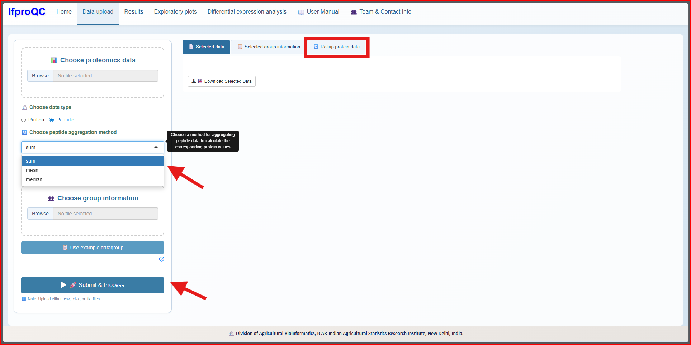
  
<strong>Figure 4:</strong> Uploading the peptide dataset

The user can also download example datasets and group information from the provided buttons within the app. The example dataset has given is a pairwise comparison (50 vs 5) of yeast lysate-UPS1 dataset from the study conducted by Ramus et al. (2016). After uploading the datasets, click the submit button:

  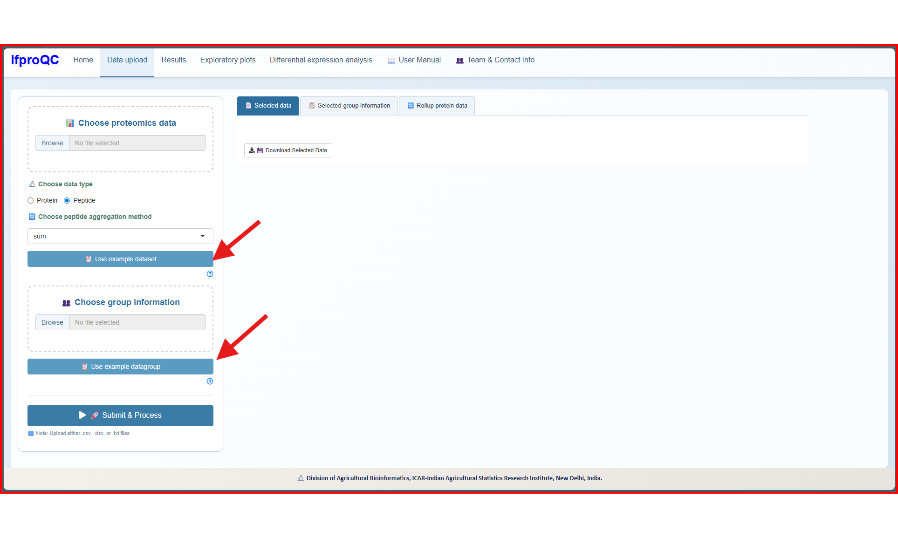
  
<strong>Figure 5:</strong> Options for example dataset and data group

### 2. Getting the Results

After uploading the datasets, click the **‘Results’** tab. The main panel will display the best combinations for the dataset based on three statistical evaluation measures: **PCV**, **PEV**, and **PMAD**. Results for all three measures, along with the **NRMSE** values, will be shown. Click the eye symbol to view these results:

  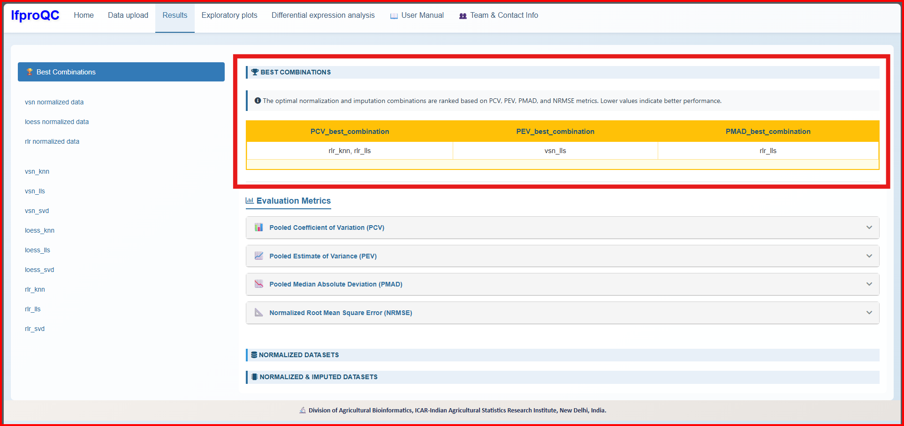
  
<strong>Figure 6:</strong> Best combinations for the dataset

Select either the most frequently occurring combination or any one of the three results. All nine combinations of normalized and imputed datasets will be displayed in the main panel, with an option to download the datasets in **.csv** format. The user can also download only the normalized datasets based on specific normalization methods:

  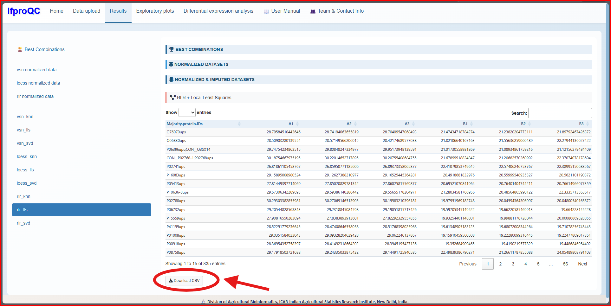
  
<strong>Figure 7:</strong> Download option for the normalized and imputed dataset

### 3. Exploratory Plots Visualization

In the **‘Exploratory Plots’** tab, users can visualize the best combination of normalization and imputation methods through various exploratory plots, including box plots, density plots, QQ plots, MDS plots, and correlation heatmaps:

  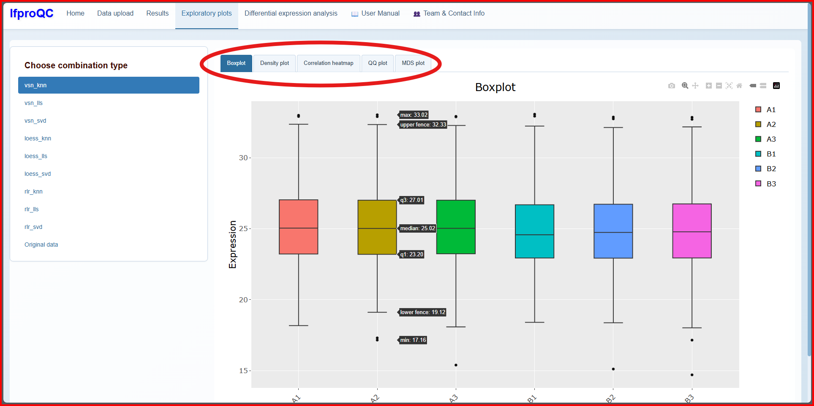
  
<strong>Figure 8:</strong> Various exploratory plots for visualization

These plots help assess the normality of the dataset and understand the relationships between sample groups.

### 4. Differential Expression Analysis

In the **‘Differential Expression Analysis’** tab, users can perform differential expression analysis between any two sample groups. Available plots include the MA plot and the volcano plot:

  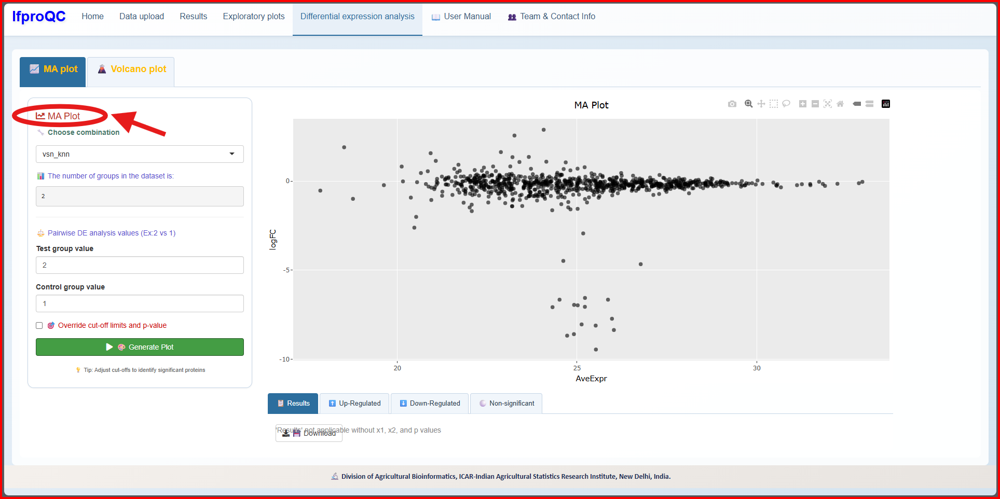
  
<strong>Figure 9:</strong> MA plot pairwise DE analysis

  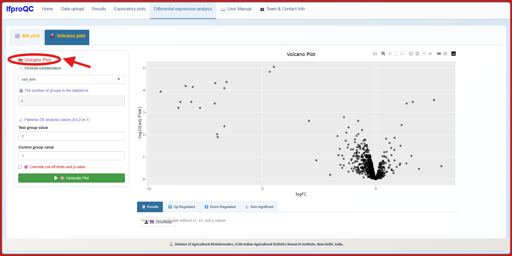
  
<strong>Figure 10:</strong> Volcano plot pairwise DE analysis

Users can adjust log-fold change values and p-values to identify up-regulated and down-regulated proteins by selecting the checkbox labeled **‘Override Cut-off Limits and P-value’**. Differentially expressed protein results can be downloaded in Excel format:

  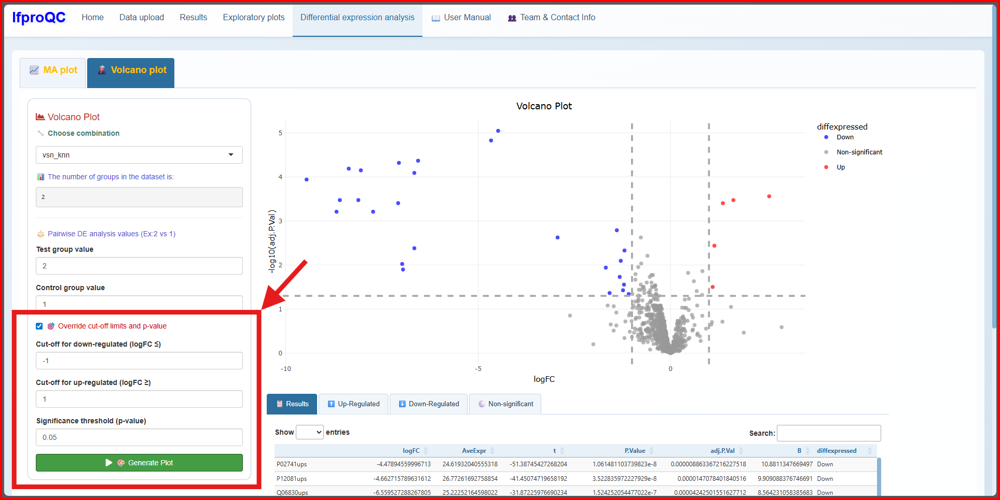
  
<strong>Figure 11:</strong> Volcano plot DE analysis with user-defined cut-off limits

  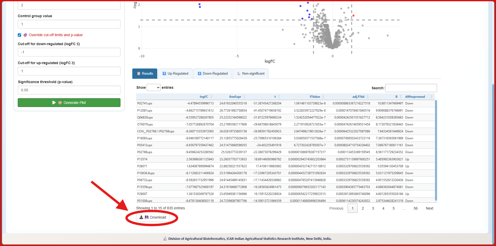
  
<strong>Figure 12:</strong> Download option for the result of DE proteins

<!-- Go to top button -->
<button onclick="topFunction()" id="goTopBtn" title="Go to top">↑</button>

